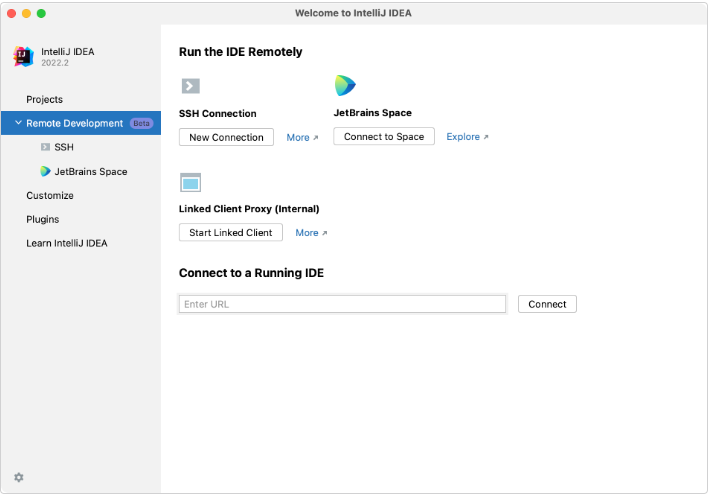
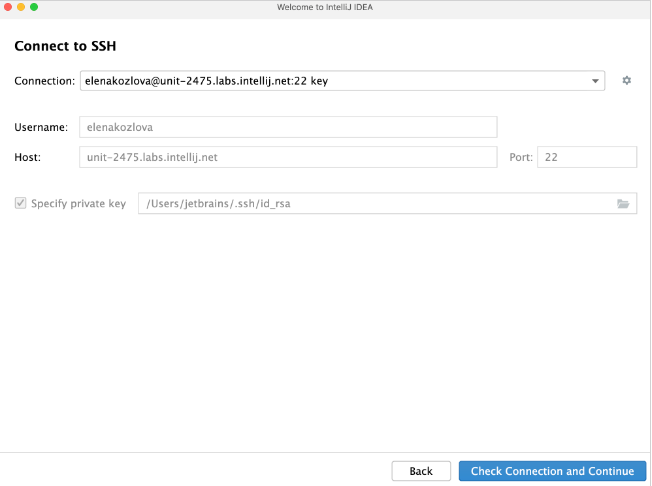
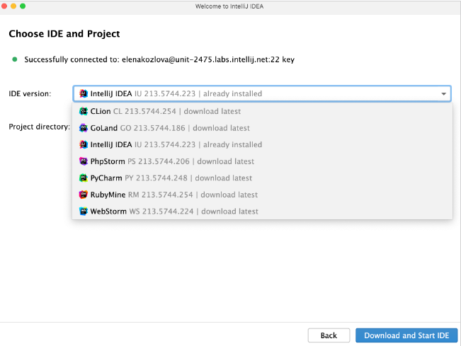

# GeoCell API
RESTful API - Spring - Kotlin - PostgreSQL

## Oracle Cloud Ifrastucture - Server

### Creation

To account for a PostgreSQL server, nginx load balancer server and apache Tomcat server, the minimum requirements are:

- 4 vCPUs, either ```x86_64``` or ```arm64``` architecture. Also, higher clock frequency is preferred to higher core count
- 8 GB RAM
- A supported version of a common Linux distribuition (Ubuntu 22.04)
- 100 GB free space in local file system
- OpenSSH server version 7.9p1 or later
- Enabled Swap is recommended

Chosen an VM located in Madrid with Ampere arm processator with 4 cores and 24 GB memory

### Configuration
Donwload the private key upon VM creation and the change its permissions
```terminal
$ chmod 400 private.key
```

Then connect to the VM using SSH
```terminal
$ ssh -i private.key [vm-ip-address]
```

Update the machine
```terminal
$ sudo apt update && sudo apt upgrade -y && sudo apt autoremove -y
```

If the upgrade install new kernel its advisable to restart the system and then connect again by SSH
```terminal
$ sudo reboot
```

Packages to install:

- Java Development Kit
- Kotlin
- Gradle
- PostgreSQL
- Postgis
- Git

```terminal
$ sudo apt install openjdk-17-jdk kotlin libgradle-plugins-java postgresql postgresql-client postgresql-common postgresql-contrib postgis git
```

## PostgreSQL configuration

### Step 1 - Check if PostgreSQL service is running

To check if the PostgreSQL service is running
```terminal
$ sudo sytemctl status postgresql.service
```
If all ok, it should print something similar to
```terminal
● postgresql.service - PostgreSQL RDBMS
     Loaded: loaded (/lib/systemd/system/postgresql.service; enabled; vendor preset: enabled)
     Active: active (exited) since Sat 2023-12-23 14:01:56 UTC; 1 day 2h ago
   Main PID: 6913 (code=exited, status=0/SUCCESS)
        CPU: 1ms
```
 If not, you should try start the service and check again
```terminal
$ sudo systemctl start postgresql.service
```

### Step 2 - Using PostgreSQL Roles and Databases

By default, Postgres uses a concept called roles to handle authentication and authorization. These are, in some ways, similar to regular *Unix-style* accounts, but Postgres does not distinguish between users and groups and instead prefers the more flexible term “role”.

Upon installation, Postgres is set up to use *peer authentication*, meaning that it associates Postgres roles with a matching Unix/Linux system account. If a role exists within Postgres, a Unix/Linux username with the same name is able to sign in as that role.

The installation procedure created a user account called **postgres** that is associated with the default Postgres role. In order to use Postgres, you can log into that account.

There are a few ways to use this account to access Postgres.

- **Switching Over to the postgres Account**

	Switch over to the **postgres** account by typing:

	```terminal
	$ sudo -i -u postgres
	```
	To access the PostgreSQL prompt immediately, type:
	
	```terminal
	postgres@server:~$ psql
	```

	From there is possible to interact with the database management system as necessary.

	To exit out, type:

	```terminal
	postgres=# \q
	postgres@server:~$ exit
	```
- **Accessing a Postgres Prompt Without Switching Accounts**

	It's also possible to run commands with the **postgres** acount directly with ```sudo```.

	```terminal
	$ sudo -u postgres psql
	``` 

### Step 3 - Creating a New Role

Currently, we have the **postgres** role configured within the database. To create new roles from the command line use the ```createuser``` command. The ```--interactive``` flag will prompt us for the name of the new role and also ask whether it should have *superuser* permissions.

Logged in as the postgres account, to create a new user, type:

```terminal
postgres@server:~$ createuser --interactive
```

If, instead, we prefer to use ```sudo``` for each command without switching from the normal account, type:

```terminal
$ sudo -u postgres createuser --interactive
```

The *script* will prompt you with some choices and, based on your responses, execute the correct Postgres commands to create a user to your specifications.

```terminal
Output
Entre name of role to add: geocell
Shall the new role be a superuser? (y/n) y
```

Is possible to get more more control by passing some additional flags. check out the option by looking at the ```man``` page for ```createuser```command:

```terminal
$ man createuser
```

### Step 4 - Creating the Database

Another assumption that the Postgres authentication system makes by default is that for any role used to log in, that role will have a database with the same name which it can access.

This means that if the user created in the last section is called **geocell**, that role will attempt to connect to a database also called “geocell” by default. We can create the appropriate database with the ```createdb`` command.

Logged in as the **postgres** account, type something like:

```terminal
postgres@server:~$ createdb geocell
```

If, instead, prefer to use ```sudo``` for each command without switching from the normal account, type:

```terminal
$ sudo -u postgres createdb geocell
```


### Step 5 - Allow the database to use geographic information

```terminal
CREATE EXTENSION postgis;
GRANT ALL ON geography_columns TO geocell;
GRANT ALL ON geometry_columns TO geocell;
GRANT ALL ON spatial_ref_sys TO geocell;
GRANT USAGE ON SCHEMA public TO geocell;
GRANT ALL PRIVILEGES ON ALL TABLES IN SCHEMA public TO geocell;
GRANT ALL PRIVILEGES ON ALL SEQUENCES IN SCHEMA public TO geocell;
```

### Step 6 - Opening a Postgres Prompt with the new Role

To log in with *peer authentication*, we need a Linux user with the same name as the new Postgres role and database.

If we don’t have a matching Linux user available, we need to create one with the ```adduser``` command. To do this, we need to use a non-**root** account with ```sudo``` privileges (meaning, not logged in as the **postgres** user):

```terminal
$ sudo adduser geocell
```

Once this new account is available, we can eitheir switch over and connect to the database by typing:

```terminal
$ sudo -i -u geocell
geocell@server:~$ psql
```

Or, inline:

```terminal
$ sudo -u geocell psql
```

Once logged in, we can get check your current connection information by typing:

```terminal
geocell=> \conninfo
```

```terminal
Output
You are connected to database "geocell" as user "geocell" via socket in "/var/run/postgresql" at port "5432".
```


## Remote IDE configuration
Since working remotely became a necessity, we will use IntelliJ IDEA, that offers the Remote Development funcionality to help with code, run, debug and deploy projects remotely.

### Connection via SSH
The connection to a remote server is done via SSH and can be started right from the welcome screen of IntelliJ IDEA.



Connect to a remote server and open the remote project

1. Ensure the Remote Development Gateway plugin is enable
2. On the IntelliJ IDEA welcome screen, select **Remote Development**. Alternatively, go to **File | Remote Development**
3. Under **SSH Connection**, click **New Connection**
4. Configure the remote server connection parameters and click **CheckConnection and Continue** to make sure the connection to the remote server is successfull.

5. On the next page of the wizard, in the **IDE version** field, select the source of the remote IDE that you want to use.

6. Click **Download and Start IDE**
IntelliJ IDEA starts JetBrains Gateway, which downloads the IDE backend, launches, and opens JetBrains Client with your remote project.